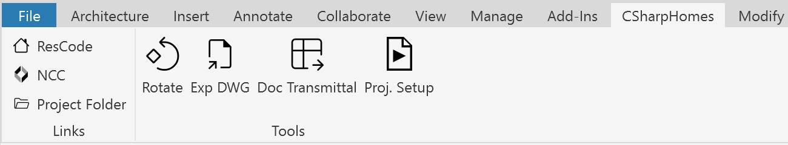
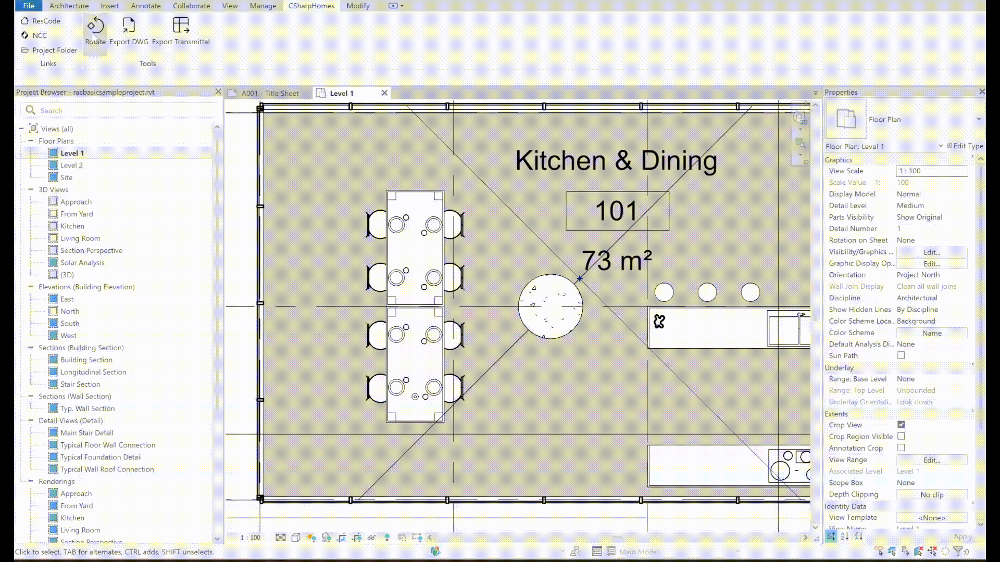

# CSharpHomes Revit Add-in

## Features

## Links Panel

- **ResCode** – Opens the Victorian Residential Development Code in your default browser.
- **NCC** – Opens the National Construction Code (NCC) 2022 edition in your default browser.
- **Project Folder** – Opens the directory containing the current Revit project file in Windows Explorer.

## Tools Panel

### Rotate
Rotates selected elements in the active view by a user-specified angle.

1. Prompts for element selection and angle input via a custom options bar.
2. Applies rotation around the vertical axis at the element's centre.

### Export DWG
Exports selected sheets to DWG format.

1. Select the sheets you want to export.
2. Choose the export directory when prompted.
3. The add-in exports the sheets using company standards.
4. After export, the destination folder automatically opens for you.

### Export Transmittal
Generates a document transmittal Excel file summarising selected sheets and their revisions.

1. Select the sheets and revisions you want to include in the transmittal.
2. Choose the directory to save the Excel file.
3. The add-in creates or updates the transmittal file with:
   - Sheet numbers and names
   - Current revision
   - Revision history

### Project Setup
Extracts project data from a PDF and applies it to the Revit Project.

1. Select the project PDF when prompted.
2. Review extracted fields in the Project Setup dialog.
3. Edit **Clean Input** values if needed.
4. Tick **Apply** for the fields you want written to the model.
5. Click **Apply Changes** to update Project Information and Design Options.
6. The Design Options dialog will open for review after changes are applied.

---

© 2025 Iorhan Vendruscolo.
